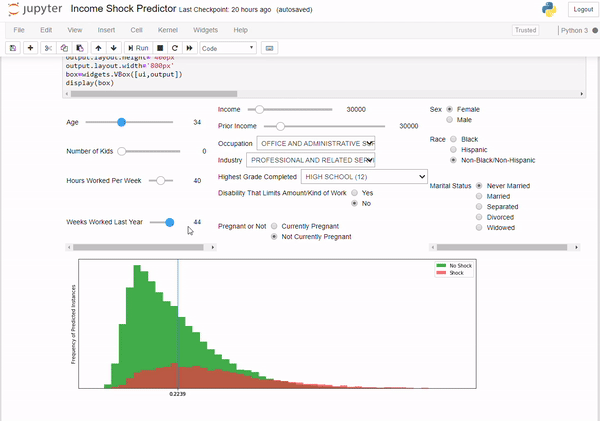

# Shock-Prophets

Cohort 14 Capstone Project for the Certificate of Data Science at Georgetown University School of Continuing Studies.

This project attempts to predict an individual's risk of suffering a negative income shock (i.e., a loss of 20% in inflation-adjusted income) in the next two years, utilizing data from the National Longitudinal Survey of Youth 1979 and 1997 cohorts.

Please remember, the prediction is not 100% accurate. The whole purpose of the project was to help us proactively prepare for the next potential income drop by trying to predict the future. 

An individual who learns that he or she is at a high risk for a negative income shock might:
-	Increase their "rainy day" or emergency fund to cover a potential spell of unemployment;
-	Update their resume or begin searching for new jobs;
-	Seek to reduce their risk of income loss, perhaps by pursuing further education or training or by moving to a region with more promising job opportunities;
-	Rebalance their investment portfolio away from risky assets such as stocks and toward safer assets, such as bonds or cash; and/or
-	Reconsider making long-term financial commitments, such as signing a lengthy automobile lease or taking out a new mortgage.

On the other hand, those who find their income shock risk is relatively low might feel greater confidence in taking on long-term financial commitments or investing in risky assets such as stocks.

#### With that said, we are not offering any financial advice to any individual, and any financial decisions should be made in consultation with appropriate expert.

Files in this repository include:

## Ingestion module

ingest_data.py - Ingests and wrangles NLSY data and saves it to a SQLite database.

nlsy.py - Importable module supporting ingestion and wrangling.

Export Data to CSV.ipynb - Saves data from the SQLite database to CSV. Most of the other Python scripts in this repository use the CSV version of the data for speedier loading.

## Data analysis and model selection

Visual Analytics.ipynb - Uses visualizations to support exploratory data analysis.

Cross-Validation.ipynb - Explores different machine learning models and exports a final model.

## Demo

Income Shock Predictor.ipynb - An interactive visualization allowing users to explore income shock risk.
